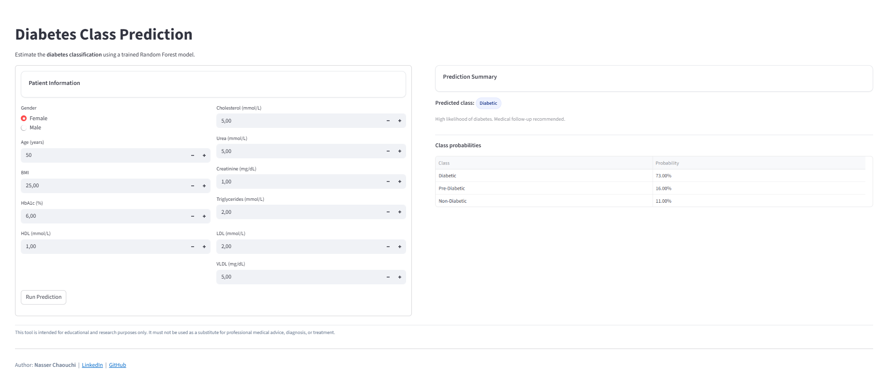

# Multiclass Diabetes Classification Project


This project aims to classify patients into **three diabetes categories** (Non-Diabetic, Diabetic, Pre-Diabetic) based on clinical and biochemical features. It includes:

- A complete machine learning pipeline built in Python
- A well-documented Jupyter notebook with data exploration, modeling, and evaluation
- A deployed **Streamlit app** for real-time prediction

[**Try the app online:**](https://multiclassdiabetes-vibkpbkqtd7zdhjbmojppp.streamlit.app/)




---

## Project Overview

This project uses a dataset of 264 patients and applies several ML models to classify diabetes status. After evaluation, the **Random Forest** model was selected based on its F1-macro score and generalization ability.

---

## Project Structure

- `dataset/` – Multiclass Diabetes Dataset.csv
- `multiclass_diabetes_classification.ipynb` – Main notebook (EDA + modeling)
- `rf_model.pkl` – Trained Random Forest model (saved with joblib)
- `app.py` – Streamlit app source code
- `requirements.txt` – Python dependencies

---

## How to Run the Project Locally

### 1. Clone the repository

```bash
git clone https://github.com/nasser-chaouchi/multiclass_diabetes_classification.git
cd multiclass-diabetes-classification
```

### 2. Create and activate a virtual environment

```bash
python -m venv venv
source venv/bin/activate  
# On Windows: .\venv\Scripts\activate
```

### 3. Install dependencies

```bash
pip install -r requirements.txt
```

### 4. Launch the Streamlit app

```bash
streamlit run app.py
```


## Model Performance Summary

| Model                | F1-score (macro) |
|----------------------|------------------|
| Logistic Regression  | 0.827            |
| Random Forest        | 0.9718           |
| K-Nearest Neighbors  | 0.6771           |

Final model accuracy on test set: **97%**  
Macro F1-score: **0.98**

---

## Business Impact

Diabetes is a global public health concern, with early detection being crucial to prevent severe complications.  
This project demonstrates how **machine learning models** can support:

- **Early identification** of patients at risk (Pre-Diabetic stage)  
- **Decision support** for healthcare professionals  
- **Raising awareness** and enabling preventive interventions  

While based on a relatively small dataset, the methodology highlights the potential of **AI-assisted medical screening tools** in real-world healthcare applications.

---

## Disclaimer

**Important Notice**  
This project and the deployed application are intended **solely for educational and research purposes**.  
They **must not** be used as a substitute for professional medical advice, diagnosis, or treatment.  
Always consult qualified healthcare providers for medical concerns.


## Built With

- Python
- scikit-learn
- pandas, seaborn, matplotlib
- Streamlit

---

## Author

**Nasser Chaouchi**  
Data Scientist  
[LinkedIn](https://www.linkedin.com/in/nasser-chaouchi/)

## License
This project is licensed under the [MIT License](https://github.com/nasser-chaouchi/multiclass_diabetes_classification/blob/main/LICENSE).

